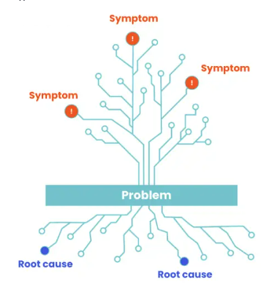
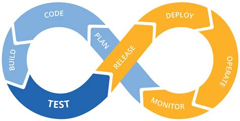
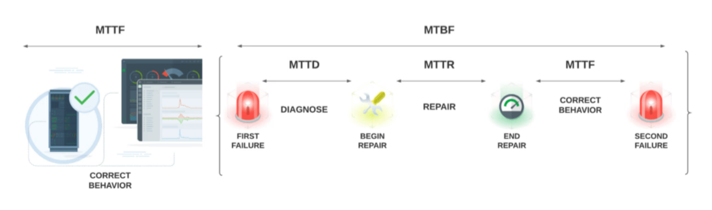

# :telescope: L'observabilité : que c'est quoi ce machin ?

## un buzzword ?
### oui ...
o11y est un numéronyme similaire à k8s. 
k8s = k <8 chars> s = Kubernetes. 
o11y = o <11 chars> y = Observability.
### et non ...
---

# :telescope: L'observabilité : que c'est quoi ce machin ?

## du monitoring ?
obserserver $\neq$ observabilité
obserserver, c'est regarder qlq chose qui est observable

le monitoring dit quand un systeme va mal, l'observabilité dit pourquoi

l'observabilité permet un monitoring qualitatif

---

# :telescope: L'observabilité : que c'est quoi ce machin ?

## Definition (possible)
Capacité d'un système a exposer des informations que l'on peut choisir d'exploiter et permettant d'appréhender son fonctionnement et son etat

----
# :telescope: L'observabilité : pourquoi exposer des infos ?

---

# :telescope: Observabilité et demarche DevOps

---  
# :telescope: L'observabilité : a quoi que ça sert ?

- donner de la visibilité a une infra (applicative & SI) complexe
- Avoir des données a la volée sur une app ou une infra
- anticiper les pannes
- permettre l'alerting et l'autoremediation
- donne de la flexibilté au devops/SRE pour tester/valider
- ...

---
  
# :telescope: L'observabilité : a quoi que ça sert ?

---
# :telescope: L'observabilité : pourquoi que c'est important ?

## Ameliorer son MTBF

---
# :telescope: L'observabilité : pourquoi que c'est important ?

- repondre aux besoins de la sûreté applicative (sûreté de fonctionnement) 
- avoir le necessaire pour faire du "Chaos Ingineering"

---

# :telescope: L'observabilité : on fait ça avec quoi ?

## Les 3 piliers
- La métrologie
- Les logs
- Les traces

---

# :telescope: L'observabilité : et on en fait quoi quoi ?

## es 4 signaux d'or (Google, livre des SRE)
- __Les latences__ : le temps qu’un service prend pour répondre à une sollicitation
- __Le trafic__ : le nombre de sollicitations simultanées auxquelles le service est soumis à un instant donné
- __Les erreurs__ : tous les événements non prévus ou non gérés par le service
- __La saturation__ : toutes données qui permettent de définir que le service ne sera plus en capacité de répondre, par exemple le taux de remplissage d’un disque dur

---
